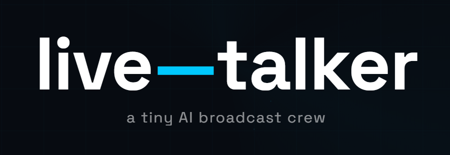
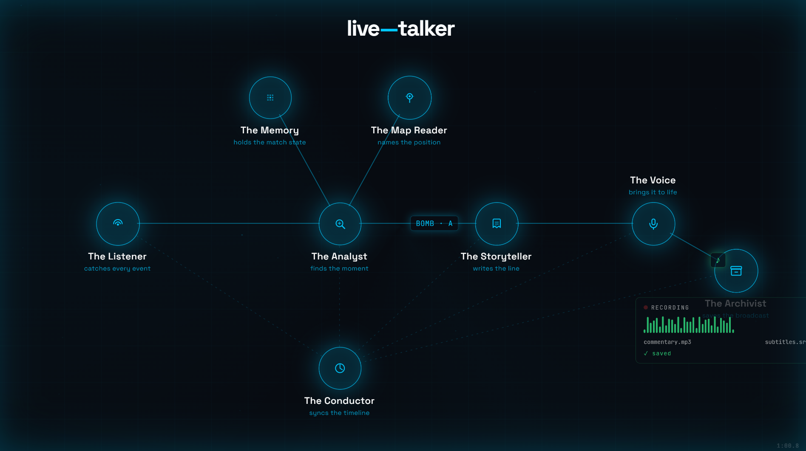
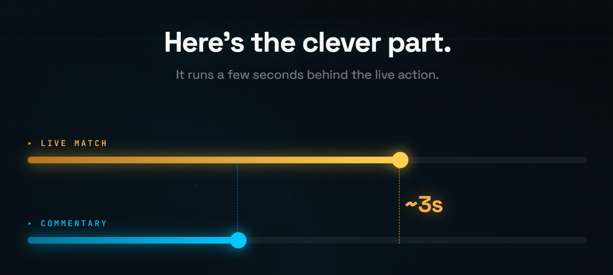
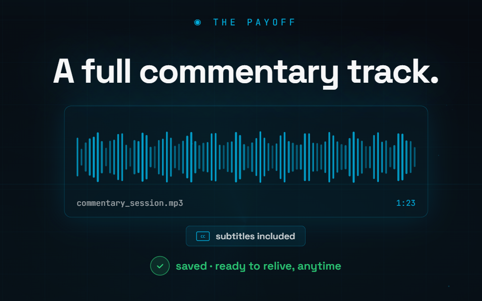

<p align="center">
  
</p>

<p align="center">
  <a href="https://green-plan.github.io/live-talker/">🔗 Homepage</a>
</p>

Real-time AI esports shoutcaster for Counter-Strike 2. Taps into live match telemetry via Game State Integration, interprets events into narrative beats, batches them into story segments, generates commentary with an LLM, renders it to speech, and plays it back on a deliberate, configurable **broadcast delay** — so the system always has complete context before it speaks.

---

## Table of Contents

- [Architecture](#architecture)
- [Getting Started](#getting-started)
- [Running](#running)
  - [Development](#development)
  - [Production](#production)
  - [Mock / Debug Mode](#mock--debug-mode)
- [CS2 Setup](#cs2-setup)
- [Broadcasting with OBS](#broadcasting-with-obs)
  - [Isolated audio via the browser overlay](#isolated-audio-via-the-browser-overlay)
  - [Syncing the video delay](#syncing-the-video-delay)
  - [Recording game and overlay as separate tracks](#recording-game-and-overlay-as-separate-tracks)
- [Platform Notes](#platform-notes)
- [Environment Variables](#environment-variables)
- [Acknowledgments](#acknowledgments)

---

## Architecture

A one-way pipeline that turns live game telemetry into spoken commentary, running a fixed delay behind real time:

**Ingest → Interpret → Batch → Narrate → Voice → Air**

<p align="center">
  
</p>

1. **Ingest** — a local HTTP listener receives the game's state-integration feed and normalizes each packet into a rolling match snapshot plus a log of discrete events.
2. **Interpret** — a game-specific analyst diffs consecutive snapshots and reads the event log to emit *beats*: meaningful moments (kills, trades, clutches, bomb plays, economy reads) tagged with an intensity. Deduplication and cooldowns keep the noise out.
3. **Batch** — beats are grouped into short, time-windowed segments. Empty windows produce nothing; silence is preserved as real dead air.
4. **Narrate** — each sealed segment becomes one short caster passage written by an LLM. This stage is *sequential*: every passage sees the caster's recent history, so the broadcast reads as one continuous story and never repeats a call.
5. **Voice** — passages render to speech in parallel, behind the sequential narration stage.
6. **Air** — a play head ("the conductor") airs each clip at its scheduled time, a fixed delay behind the live game, strictly in order — stretching the delay elastically if a render runs late rather than ever playing out of sequence. Where the audio actually goes (desktop, or an isolated [OBS overlay](#isolated-audio-via-the-browser-overlay)) is a swappable last step, not baked into the conductor.

The deliberate broadcast delay is the central idea: by the time the caster speaks, the segment has fully resolved, so commentary is accurate and complete instead of racing incomplete data.

<p align="center">
  
</p>

The code is layered so the pipeline stays game-agnostic and the game knowledge is isolated:

- **`game/` and `synthesis/`** hold the brains. The CS2-specific pieces (state interpretation, caster persona and prompts) sit under `cs2/` subfolders behind generic interfaces — a second game is added alongside, not by rewriting the pipeline.
- **`infra/`** holds boundary adapters: anything that talks to the outside world (game feed, LLM/TTS HTTP, audio playback).
- **`orchestrator/`** is the game-agnostic engine driving batching, the synthesis stages, and the conductor.
- **`overlay/`** and **`homepage/`** are independent frontend subprojects (own `package.json`/lockfile, not npm workspace members) — see their own READMEs.

See [`AGENTS.md`](AGENTS.md) for the layering rules and [`docs/`](docs/) for the design specs.

---

## Getting Started

**Requirements:** Node.js 24 (pinned via `mise` — see `mise.toml`), npm.

1. **Configure.** Copy the env template and fill in what you need:
   ```bash
   cp .env.example .env
   ```
   For real LLM + TTS commentary, set `OPENROUTER_API_KEY`. To skip that entirely and run
   without any API key, see [Mock / Debug Mode](#mock--debug-mode). The full list of
   variables (including ones below for the overlay/OBS setup) is in
   [Environment Variables](#environment-variables).

2. **Install.**
   ```bash
   npm install
   ```

That's the core backend. If you also want the [browser overlay](#isolated-audio-via-the-browser-overlay)
(OBS-isolated audio + live visual), install its own dependencies too:
```bash
cd overlay && npm install && cd ..
```

---

## Running

CS2 GSI listens on `PORT` (default `3000`). Health endpoint is on `PORT+1`. The overlay (when
enabled) listens on `OVERLAY_PORT` (default `PORT+2`) — see [Broadcasting with OBS](#broadcasting-with-obs).

### Development

| Scenario | Command |
|---|---|
| Backend only (desktop audio) | `npm run dev` |
| Backend + browser overlay | `npm run dev:overlay` — builds `overlay/` then starts the backend with `OVERLAY=true` |

Both use `tsx --watch` for hot reload.

### Production

| Scenario | Commands |
|---|---|
| Backend only (desktop audio) | `npm run build` → `npm start` |
| Backend + browser overlay | `npm run build` → `npm run build:overlay` → `npm run start:overlay` |

`build:overlay`/`start:overlay` are separate from the main build/start so a deployment that
doesn't use OBS never needs to build the overlay at all.

### Mock / Debug Mode

Set `MOCK=true` to run the full pipeline without API keys (works with any of the commands above,
e.g. `MOCK=true npm run dev` or `MOCK=true npm run dev:overlay`):

- **Mock commentary** — returns a quick summary of the buffered events instead of calling the LLM (delay configurable via `MOCK_TEXT_DELAY_MS`).
- **Mock speech** — renders the text with the OS's built-in voice (Windows SAPI, no install needed) instead of the TTS API, then plays it through the normal audio path — so you still hear real audio (`MOCK_SPEECH_DELAY_MS`).

---

## CS2 Setup

CS2 must be configured to POST game state to `http://localhost:3000`. Generate the config file:

```typescript
import { GSIConfigWriter } from 'cs2-gsi-z';
GSIConfigWriter.generate({ name: 'live-talker', uri: 'http://localhost:3000' });
```

Move the generated `.cfg` file to your CS2 `cfg/` directory and restart CS2.

---

## Broadcasting with OBS

### Isolated audio via the browser overlay

By default, commentary plays through the desktop's own audio output — fine for testing, but hard
to isolate as its own track for streaming. The **browser overlay** solves this: a small page that
OBS adds as a Browser Source, which plays each clip through its own `<audio>` element and renders
a live waveform plus a timestamped history of what's been said. It also exposes a **pause
shoutcasting** button that stops the LLM/TTS pipeline backend-wide (no API calls, no tokens spent)
without losing warm match state, for whenever the process is running but nobody's live.

1. Start the backend with the overlay active — see [Running](#running) (`npm run dev:overlay` or
   the production `build:overlay`/`start:overlay` pair).
2. In OBS, add a **Browser Source** pointed at `http://localhost:3002/` (or your `OVERLAY_PORT`).
3. Check **Control audio via OBS** on that source — this captures the page's audio as its own
   isolated track, completely separate from desktop output.

The page also works in a plain browser tab for monitoring — any number of tabs/OBS sources can be
connected at once, each with its own mute toggle.

### Syncing the video delay

The caster's commentary lags the live action on purpose (see [Architecture](#architecture)), so
OBS needs to hold the *raw game feed* — video and its own audio — back by the same amount, on the
**game source specifically** (not a global **Stream Delay**, which would shift the game feed and
the already-correctly-timed commentary together and fix nothing).

- **Video** — add a **Render Delay** filter to the game capture source. OBS caps it at 500ms per
  instance, so matching the broadcast delay (`delayMs` in `src/config.ts`, 10s by default) means
  stacking `ceil(delayMs / 500)` instances — 20 for the default. Recompute if you change `delayMs`.
- **The game's own audio** (gunfire, voice chat) — set **Sync Offset (ms)** to `delayMs` in that
  source's Advanced Audio Properties. No stacking needed; this field isn't capped.
- **The commentary and overlay audio** — no added delay. Both already air at `anchor + delayMs`
  straight out of the pipeline, so they're already in sync with the now-delayed game feed.

### Recording game and overlay as separate tracks

If you're recording rather than streaming live, give the game's video+audio and the overlay's
audio different track numbers (Advanced Audio Properties → **Tracks**), then pick which tracks get
muxed into the output file under **Settings → Output → Recording**. That keeps them independently
adjustable afterward instead of needing a re-record. The overlay's visual widget is only the
Browser Source's *picture* and is independent of its audio — hide that source's eye icon if you
want its sound captured without compositing its visual into the frame.

---

## Platform Notes

**WSL2** — audio playback (desktop mode, not the overlay) routes through the Windows audio stack
via `powershell.exe`. Audio files are written to the Windows `%TEMP%` directory so PowerShell can
open them with a normal `C:\` path. No extra setup needed — this is handled automatically when
`WSL_DISTRO_NAME` is set in the environment.

---

## Environment Variables

<p align="center">
  
</p>

| Variable | Default | Description |
|---|---|---|
| `PORT` | `3000` | GSI listener port; health runs on `PORT+1` |
| `OPENROUTER_API_KEY` | — | Required for real LLM + TTS |
| `MOCK` | `false` | Enable both mock synthesizers (no API key needed) |
| `MOCK_TEXT` | `false` | Mock LLM only |
| `MOCK_SPEECH` | `false` | Mock TTS only (uses Windows SAPI) |
| `MOCK_TEXT_DELAY_MS` | `900` | Simulated LLM latency in mock mode |
| `MOCK_SPEECH_DELAY_MS` | `900` | Simulated TTS latency in mock mode |
| `TTS_MODE` | `plain` | `plain` or `gemini` (expressive inline tags) |
| `LOG_LEVEL` | `info` | `trace` / `debug` / `info` / `warn` / `error` |
| `RECORD_BROADCAST` | — | `true` to record the full session to `temp/broadcast-<timestamp>.wav` (with a matching `.srt` subtitle track alongside it), or a file path to choose the location yourself |
| `OVERLAY` | `false` | Air audio through the [browser overlay](#isolated-audio-via-the-browser-overlay) (for OBS) instead of desktop playback |
| `OVERLAY_PORT` | `PORT+2` | Port for the overlay's HTTP + WebSocket server |

---

## Acknowledgments

Map callout/navigation data (`etc/nav-info/`) comes from [awpy](https://github.com/pnxenopoulos/awpy)
(MIT) — see [`etc/nav-info/THIRD_PARTY_LICENSE.txt`](etc/nav-info/THIRD_PARTY_LICENSE.txt). The
homepage's full third-party dependency list is generated at build time into
`third-party-licenses.txt`, linked from its footer.
